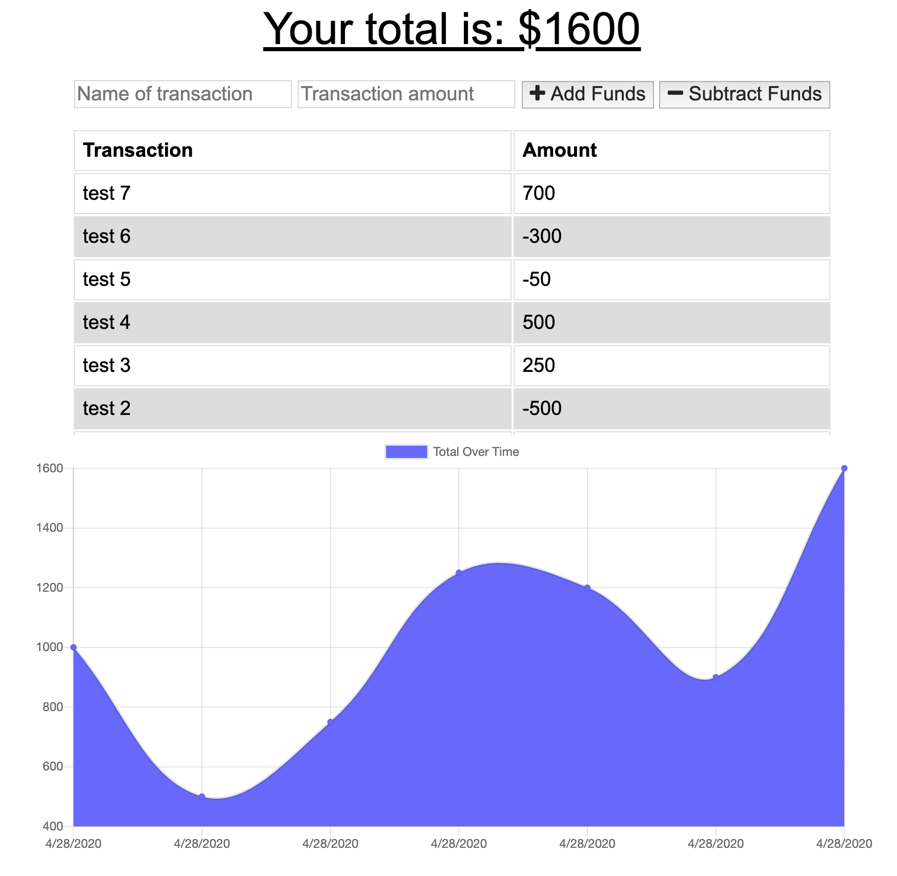

# HW18-Progressive-Budget
My submission for the HW18-Progressive-Budget assignment.

1) Description: This is a budget tracker application that has both online and offline functionality.  The user is able to add expenses and deposits to their budget with or without an internet connection.  If the user enters transactions offline, then those entries will populate the total when the user goes back online.

2) Link to deployed application: https://thawing-fortress-98587.herokuapp.com/

3) Screenshot: 